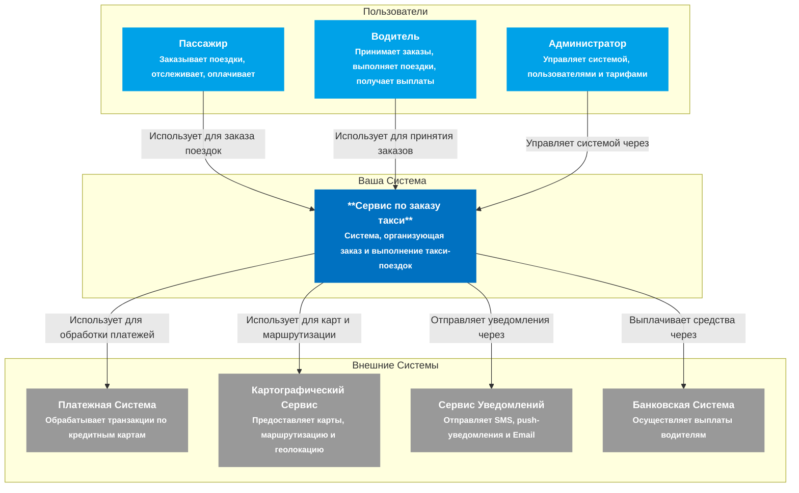

Here's a C4 Architecture overview for a "сервис по заказу такси" (taxi ordering service), covering high-level decisions, a System Context diagram, and a Container diagram.

---

### 1. High-Level Architecture Decisions

Designing a taxi ordering service requires addressing high scalability, real-time data processing, and reliable communication. The following high-level architectural decisions are made:

1.  **Microservices Architecture:** The system will be decomposed into a set of loosely coupled, independently deployable microservices. This approach enhances scalability, allows for independent team development, improves fault isolation, and enables technology diversity for different services. Key services include User Management, Ride Management, Driver Management, Payment, and Geolocation.
2.  **Cloud-Native Deployment:** The service will leverage a public cloud provider (e.g., AWS, GCP, Azure) to benefit from managed services for databases, message queues, serverless functions, and scaling capabilities. This reduces operational overhead and provides robust infrastructure.
3.  **Event-Driven Communication:** Asynchronous communication via a message broker (e.g., Kafka or RabbitMQ) will be central for inter-service communication and real-time updates. This decouples services, ensures responsiveness, and supports real-time features like driver location updates and ride status changes.
4.  **API-First Approach:** All client applications (rider app, driver app, admin panel) will interact with the backend through well-defined RESTful APIs, exposed via an API Gateway. This ensures a consistent interface and allows for independent evolution of clients and services.
5.  **External Service Integration:** Critical functionalities will rely on integrations with specialized third-party services. This includes:
    *   **Mapping Services:** For real-time location tracking, route optimization, and geocoding.
    *   **Payment Gateways:** For secure processing of credit card transactions and payouts.
    *   **Notification Services:** For sending SMS, push notifications, and emails to users and drivers.
6.  **Mobile-First Design:** Given the nature of the service, robust and intuitive mobile applications for both riders and drivers are paramount. The backend APIs are designed to cater specifically to the requirements of these mobile clients.
7.  **Polyglot Persistence:** While relational databases (e.g., PostgreSQL) will be used for transactional data, other database types (e.g., NoSQL for geospatial data, caching solutions) may be introduced for specific use cases to optimize performance and scalability.

---

### 2. C4 System Context Diagram

The System Context diagram illustrates how the "Сервис по заказу такси" interacts with its users and other external systems.

---

### 3. C4 Container Diagram

The Container diagram zooms into the "Сервис по заказу такси" to show the major deployable components (applications/services, databases, message queues) and their interactions.

```mermaid
graph TD
    %% C4_Container Diagram for Taxi Ordering Service
    
    subgraph "Клиентские Приложения"
        C1["**Мобильное Приложение Пассажира**<br><small>iOS/Android App</small>"]:::container
        C2["**Мобильное Приложение Водителя**<br><small>iOS/Android App</small>"]:::container
        C3["**Веб-Панель Администратора**<br><small>Single Page Application в браузере</small>"]:::container
    end

    subgraph "Система 'Сервис по заказу такси'"
        direction LR
        APIGW["**API Gateway**<br><small>Обрабатывает входящие запросы, аутентификацию и маршрутизацию</small>"]:::container
        
        subgraph "Микросервисы"
            UM["**Сервис Управления Пользователями**<br><small>Управление профилями пассажиров/водителей, аутентификация</small>"]:::container
            RM["**Сервис Управления Поездками**<br><small>Создание, отслеживание, завершение поездок, матчинг</small>"]:::container
            DM["**Сервис Управления Водителями**<br><small>Управление статусом водителей, доступностью, рейтингами</small>"]:::container
            PM["**Сервис Платежей**<br><small>Обработка оплаты, биллинг, интеграция с платежными системами</small>"]:::container
            NFS["**Сервис Уведомлений (внутренний)**<br><small>Оркестрирует отправку уведомлений</small>"]:::container
            GEL["**Сервис Геолокации**<br><small>Отслеживание местоположения, геозоны, расчет маршрутов</small>"]:::container
        end

        subgraph "Хранилища Данных"
            DBU["**База Данных Пользователей**<br><small>PostgreSQL (профили пользователей)</small>"]:::database
            DBR["**База Данных Поездок**<br><small>PostgreSQL (детали поездок, история)</small>"]:::database
            DBD["**База Данных Водителей**<br><small>PostgreSQL (данные водителей, доступность)</small>"]:::database
            MQ["**Очередь Сообщений**<br><small>Kafka / RabbitMQ (асинхронное взаимодействие)</small>"]:::queue
        end
    end

    subgraph "Внешние Системы"
        ES1_c["Платежная Система<br><small>Stripe/ЮKassa API</small>"]:::external_system
        ES2_c["Картографический Сервис<br><small>Google Maps / OpenStreetMap API</small>"]:::external_system
        ES3_c["Сервис Уведомлений<br><small>Twilio / SendGrid / FCM</small>"]:::external_system
        ES4_c["Банковская Система<br><small>API банка для выплат</small>"]:::external_system
    end

    %% Relationships
    C1 -- "Использует REST/HTTP API" --> APIGW
    C2 -- "Использует REST/HTTP API" --> APIGW
    C3 -- "Использует REST/HTTP API" --> APIGW

    APIGW -- "Маршрутизирует запросы к" --> UM
    APIGW -- "Маршрутизирует запросы к" --> RM
    APIGW -- "Маршрутизирует запросы к" --> DM
    APIGW -- "Маршрутизирует запросы к" --> PM

    UM -- "Читает и записывает данные" --> DBU
    RM -- "Читает и записывает данные" --> DBR
    DM -- "Читает и записывает данные" --> DBD

    %% Event-driven communication
    UM -- "Публикует события о пользователях" --> MQ
    RM -- "Публикует/Подписывается на события о поездках" --> MQ
    DM -- "Публикует/Подписывается на события о водителях" --> MQ
    PM -- "Публикует/Подписывается на события об оплате" --> MQ
    NFS -- "Подписывается на события для отправки уведомлений" --> MQ
    GEL -- "Публикует/Подписывается на события о геолокации" --> MQ

    %% Synchronous API calls between services
    RM -- "Запрашивает статус/доступность" --> DM
    RM -- "Запрашивает текущее местоположение" --> GEL
    RM -- "Запрашивает пользовательские данные" --> UM
    RM -- "Инициирует транзакцию" --> PM

    %% External System Integrations
    PM -- "Использует API для проведения платежей" --> ES1_c
    PM -- "Инициирует банковские выплаты" --> ES4_c
    GEL -- "Использует API для карт и геоданных" --> ES2_c
    NFS -- "Отправляет сообщения через" --> ES3_c
    
    %% Styles (Mimicking C4 elements)
    classDef container fill:#438DD5,stroke:#366B9A,color:#ffffff,font-weight:bold;
    classDef database fill:#6D9EEB,stroke:#5F7DAB,color:#ffffff,font-weight:bold;
    classDef queue fill:#80C8F6,stroke:#5FA1CC,color:#ffffff,font-weight:bold;
    classDef person fill:#00A2E8,stroke:#00A2E8,color:#ffffff,font-weight:bold;
    classDef system fill:#0071C1,stroke:#0071C1,color:#ffffff,font-weight:bold;
    classDef external_system fill:#999999,stroke:#999999,color:#ffffff,font-weight:bold;
```

