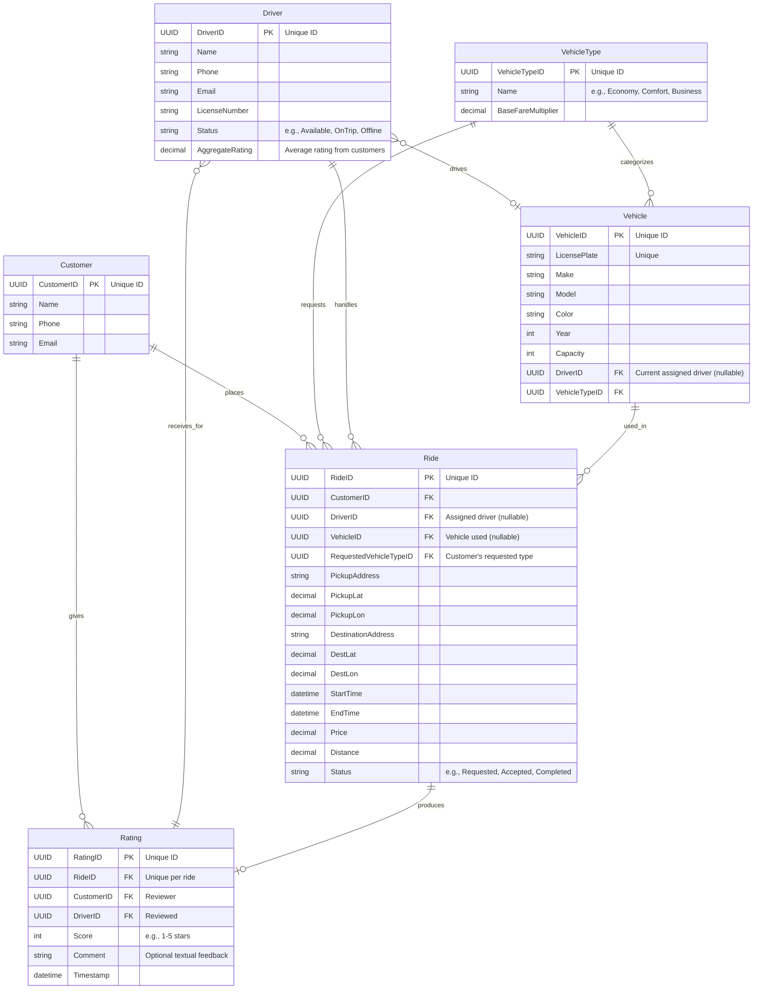

Here is a conceptual data model for a "taxi ordering service" (сервис по заказу такси).

---

### 1. Textual Description of Entities and Relationships

**Entities:**

1.  **Customer**: Represents a user who places taxi orders.
    *   `CustomerID` (Primary Key): Unique identifier for the customer.
    *   `Name`: Full name of the customer.
    *   `Phone`: Contact phone number of the customer.
    *   `Email`: Email address of the customer.

2.  **Driver**: Represents a driver who fulfills taxi orders.
    *   `DriverID` (Primary Key): Unique identifier for the driver.
    *   `Name`: Full name of the driver.
    *   `Phone`: Contact phone number of the driver.
    *   `Email`: Email address of the driver.
    *   `LicenseNumber`: Driver's license number.
    *   `Status`: Current status of the driver (e.g., 'Available', 'OnTrip', 'Offline').
    *   `AggregateRating`: Average rating received by the driver from customers.

3.  **VehicleType**: Defines different categories of vehicles available in the service.
    *   `VehicleTypeID` (Primary Key): Unique identifier for the vehicle type.
    *   `Name`: Name of the vehicle type (e.g., 'Economy', 'Comfort', 'Business', 'Van').
    *   `BaseFareMultiplier`: A factor used in calculating the base fare for this vehicle type.

4.  **Vehicle**: Represents a specific physical taxi vehicle.
    *   `VehicleID` (Primary Key): Unique identifier for the vehicle.
    *   `LicensePlate`: Vehicle's license plate number (unique).
    *   `Make`: Manufacturer of the vehicle (e.g., 'Toyota', 'Mercedes').
    *   `Model`: Model of the vehicle (e.g., 'Camry', 'E-Class').
    *   `Color`: Color of the vehicle.
    *   `Year`: Manufacturing year of the vehicle.
    *   `Capacity`: Maximum number of passengers the vehicle can carry.
    *   `DriverID` (Foreign Key, nullable): References the `Driver` currently assigned to operate this vehicle. Can be NULL if the vehicle is not assigned or off-duty.
    *   `VehicleTypeID` (Foreign Key): References the `VehicleType` this vehicle belongs to.

5.  **Ride**: Represents a single taxi order or trip. This is the core transactional entity.
    *   `RideID` (Primary Key): Unique identifier for the ride.
    *   `CustomerID` (Foreign Key): References the `Customer` who placed the order.
    *   `DriverID` (Foreign Key, nullable): References the `Driver` assigned to handle this ride. Can be NULL if no driver has been assigned yet.
    *   `VehicleID` (Foreign Key, nullable): References the `Vehicle` used for this ride. Can be NULL if not yet assigned or ride cancelled.
    *   `RequestedVehicleTypeID` (Foreign Key): References the `VehicleType` requested by the customer for this ride.
    *   `PickupAddress`: Full address of the pickup location.
    *   `PickupLat`: Latitude of the pickup location.
    *   `PickupLon`: Longitude of the pickup location.
    *   `DestinationAddress`: Full address of the destination location.
    *   `DestLat`: Latitude of the destination location.
    *   `DestLon`: Longitude of the destination location.
    *   `StartTime`: Timestamp when the ride was requested or started.
    *   `EndTime`: Timestamp when the ride was completed or cancelled.
    *   `Price`: Calculated fare for the ride.
    *   `Distance`: Distance covered during the ride in kilometers/miles.
    *   `Status`: Current status of the ride (e.g., 'Requested', 'Accepted', 'InProgress', 'Completed', 'Cancelled').

6.  **Rating**: Represents a customer's review and rating given to a driver after a completed ride.
    *   `RatingID` (Primary Key): Unique identifier for the rating.
    *   `RideID` (Foreign Key): References the `Ride` for which the rating was given. (Unique constraint on RideID to ensure one customer rating per ride).
    *   `CustomerID` (Foreign Key): References the `Customer` who gave the rating.
    *   `DriverID` (Foreign Key): References the `Driver` who received the rating.
    *   `Score`: The numerical rating (e.g., 1 to 5 stars).
    *   `Comment`: Optional textual feedback from the customer.
    *   `Timestamp`: Date and time when the rating was submitted.

**Relationships:**

1.  **Customer `places` Ride**:
    *   A `Customer` can place **many** `Ride`s.
    *   A `Ride` is placed by **one** `Customer`.
    *   (One-to-Many: `Customer` to `Ride`. `CustomerID` is a foreign key in `Ride`.)

2.  **Driver `drives` Vehicle**:
    *   A `Driver` can drive **zero or one** `Vehicle` at a time.
    *   A `Vehicle` can be driven by **zero or one** `Driver` at a time.
    *   (One-to-One Optional: `Driver` to `Vehicle`. `DriverID` is a foreign key in `Vehicle`, and it is nullable.)

3.  **VehicleType `categorizes` Vehicle**:
    *   A `VehicleType` can categorize **many** `Vehicle`s.
    *   A `Vehicle` belongs to **one** `VehicleType`.
    *   (One-to-Many: `VehicleType` to `Vehicle`. `VehicleTypeID` is a foreign key in `Vehicle`.)

4.  **VehicleType `is_requested_for` Ride**:
    *   A `VehicleType` can be requested for **many** `Ride`s.
    *   A `Ride` is requested for **one** `VehicleType`.
    *   (One-to-Many: `VehicleType` to `Ride`. `RequestedVehicleTypeID` is a foreign key in `Ride`.)

5.  **Driver `handles` Ride**:
    *   A `Driver` can handle **many** `Ride`s (over time).
    *   A `Ride` is handled by **one** `Driver` (once assigned and completed).
    *   (One-to-Many: `Driver` to `Ride`. `DriverID` is a foreign key in `Ride`.)

6.  **Vehicle `is_used_in` Ride**:
    *   A `Vehicle` can be used in **many** `Ride`s (over time).
    *   A `Ride` uses **one** `Vehicle`.
    *   (One-to-Many: `Vehicle` to `Ride`. `VehicleID` is a foreign key in `Ride`.)

7.  **Customer `gives` Rating**:
    *   A `Customer` can give **many** `Rating`s.
    *   A `Rating` is given by **one** `Customer`.
    *   (One-to-Many: `Customer` to `Rating`. `CustomerID` is a foreign key in `Rating`.)

8.  **Driver `receives_for` Rating**:
    *   A `Driver` can receive **many** `Rating`s.
    *   A `Rating` is received by **one** `Driver`.
    *   (One-to-Many: `Driver` to `Rating`. `DriverID` is a foreign key in `Rating`.)

9.  **Ride `produces` Rating**:
    *   A `Ride` can produce **zero or one** `Rating` (specifically, a customer-to-driver rating).
    *   A `Rating` is produced for **one** `Ride`.
    *   (One-to-One Optional: `Ride` to `Rating`. `RideID` is a foreign key in `Rating` with a unique constraint.)

---

### 2. Mermaid.js ER Diagram Code Block

